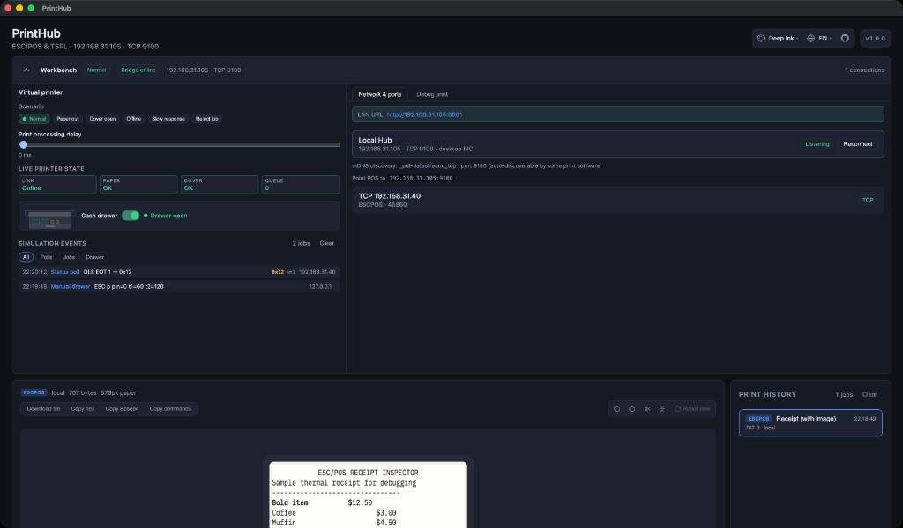
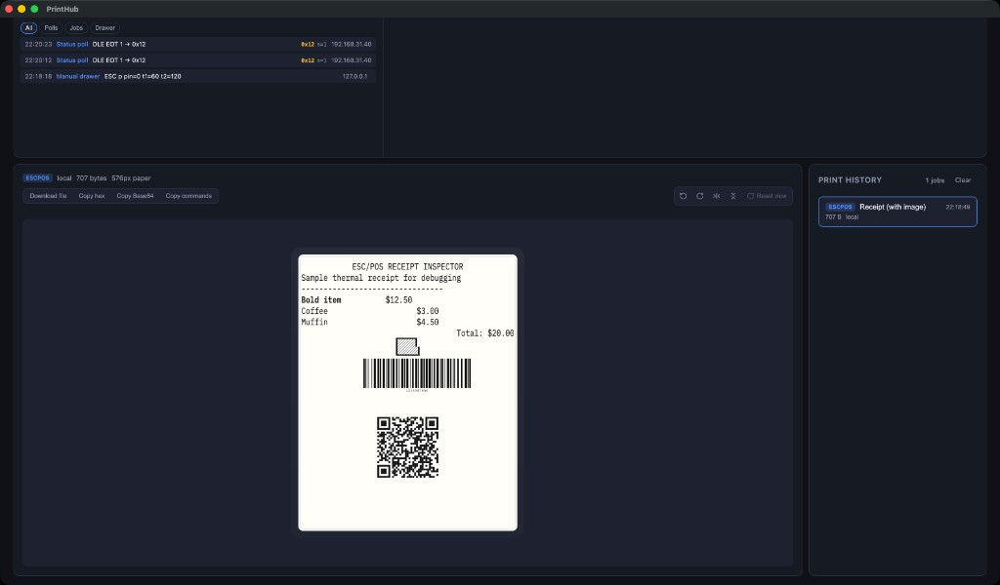
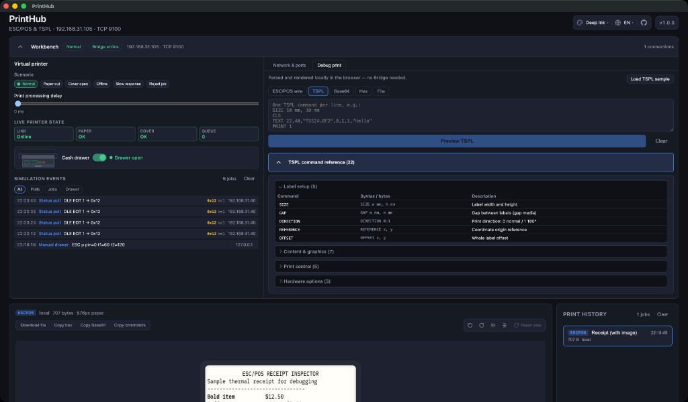
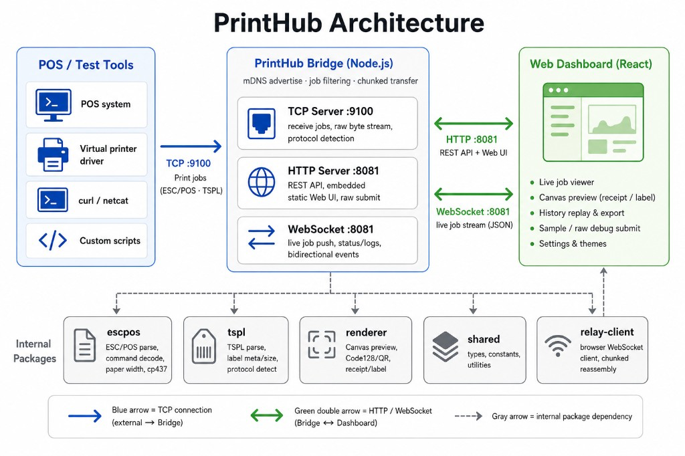

# PrintHub

> **中文：** [README.zh.md](./README.zh.md)

[](LICENSE)
[](https://github.com/JackieLeee/PrintHub/releases)
[](https://nodejs.org/)
[](https://pnpm.io/)
[](https://www.typescriptlang.org/)
[](https://react.dev/)

## Background

Cash registers, POS apps, and label printers usually send **raw ESC/POS or TSPL** over TCP — not PDF or images. Without a physical printer, it is hard to tell whether the bytes are correct.

**PrintHub** is a **LAN virtual printer**: it accepts the same payloads as real hardware and shows them in a browser — live preview, history, samples, and raw debug submit.

## What it does

| Capability | Description |
|------------|-------------|
| **Receive** | ESC/POS receipts and TSPL labels on TCP **9100** |
| **Preview** | Canvas receipt/label preview (ESC/POS + TSPL) |
| **History** | Last **50** jobs in the browser; replay and export |
| **Debug** | ESC/POS & TSPL samples; File / Hex / Base64 submit — **works offline** without Bridge |
| **Workbench** | Virtual printer + **Network & ports** / **Debug print** tabs |
| **Themes & i18n** | 10 UI themes; **English / 中文**; persisted (`settings.json` on desktop) |
| **Printer sim** | Scenario simulation, DLE EOT status, cash-drawer kick, event log |
| **Desktop app** | Electron with Bridge built-in, menu-bar tray, optional LAN HTTP |
| **mDNS** | `_pdl-datastream._tcp` on port **9100** for printer discovery |

| Port | Role |
|------|------|
| **9100** | TCP — print data (always on) |
| **8081** | HTTP + WebSocket + Web UI (optional in desktop; always on in CLI) |

### Desktop app (macOS & Windows)

Bridge runs inside the Electron app. TCP **9100** is always available; LAN HTTP is **off by default** and can be enabled from the tray.

Download from [Releases](https://github.com/JackieLeee/PrintHub/releases):

| Platform | Artifact |
|----------|----------|
| **macOS** | `*-arm64.dmg` (~110 MB, Apple Silicon) · `*-universal.dmg` (~200 MB, Apple Silicon + Intel) |
| **Windows** | `*.exe` NSIS installer (x64) |

```bash
pnpm install
pnpm dev:desktop       # build & launch (macOS / Windows / Linux)
pnpm dist:desktop      # macOS arm64 + universal .dmg (run on macOS)
pnpm dist:desktop:win  # Windows NSIS .exe (run on Windows)
```

**Windows shell:** frameless window with **macOS-style traffic lights** (red / yellow / green) on the left, integrated title bar, overlay scrollbars, and a light tray icon on the dark taskbar.

**macOS shell:** native menu-bar tray icon and system window chrome.

> **Windows / first install:** `pnpm install` tries to download Electron (~100MB); if GitHub is blocked it auto-retries via npmmirror. If it still fails, run `pnpm --filter @virt-printer/desktop run install:electron`, or set `ELECTRON_MIRROR=https://npmmirror.com/mirrors/electron/` and retry.

> **Not code-signed.** Release builds are **unsigned** (no Apple Developer ID / Windows Authenticode). macOS may block the first launch — **right-click PrintHub → Open**, or allow under **System Settings → Privacy & Security**. Windows SmartScreen may warn on first run — click **More info → Run anyway**.

Tray menu: status (Bridge / TCP / mDNS / LAN), copy LAN URL, HTTP port, **Language** (EN / 中文), restart Bridge, quit. Theme and language sync between the Web UI and tray (`settings.json` + localStorage).

On **macOS** and **Windows**, tray rows use label prefixes — **🟢 / 🟡 / 🔴** for status, **▣ / ⛓ / 🌐** etc. for actions — because Electron tray menus do not reliably render custom icons. **Linux** uses SVG menu icons.

| Workbench | Preview & history | Debug print |
|:---:|:---:|:---:|
|  |  |  |

### Web demo (GitHub Pages)

UI only — good for themes and **offline** debug preview. TCP print and sim need a local Bridge or desktop app.

**Live demo:** https://jackieleee.github.io/PrintHub/

### Printer simulation

| Scenario | Behavior |
|----------|----------|
| **Normal** | Standard DLE EOT responses |
| **Paper out** | Paper-out status bits; TCP stays connected |
| **Cover open** | Cover-open status bit; TCP stays connected |
| **Offline** | Rejects new TCP connections |
| **Slow** | Configurable status delay |
| **Reject job** | Drops incoming print jobs |

```bash
curl http://localhost:8081/sim/config
curl -X POST http://localhost:8081/sim/config \
  -H "Content-Type: application/json" -d '{"scenario":"paper-out"}'
curl -X POST http://localhost:8081/sim/events/clear
```

## Usage

**Requirements:** Node.js 20+, pnpm 9+

```bash
pnpm install
pnpm dev          # build Web UI + start Bridge
pnpm build:web    # production Web UI (CI / GitHub Pages)
```

1. Open **http://localhost:8081** (or your LAN IP).
2. Point POS / apps at **`<host>:9100`**.
3. Use the **workbench** for network info, debug print, and sim scenarios.

**TCP smoke test:**

```bash
printf '\x1b@\x1ba\x01Hello PrintHub\n\x1dV\x00' | nc -N localhost 9100
```

**HTTP raw submit:**

```bash
curl -X POST http://localhost:8081/print/raw \
  -H "Content-Type: application/octet-stream" \
  --data-binary @sample.bin
```

## Architecture



- `apps/desktop` — Electron (Bridge, tray, optional LAN HTTP)
- `apps/web` — React dashboard
- `packages/bridge` — TCP, HTTP API, WebSocket, sim, mDNS
- `packages/escpos`, `packages/tspl`, `packages/renderer` — parse & render
- `packages/shared`, `packages/relay-client` — types & WS client

**CLI:** `pnpm dev` serves `apps/web/dist` on **8081**. **Desktop:** Bridge in Electron main process; UI via IPC.

## Star History

<a href="https://www.star-history.com/?repos=JackieLeee%2FPrintHub&type=date&legend=bottom-right">
 <picture>
   <source media="(prefers-color-scheme: dark)" srcset="https://api.star-history.com/chart?repos=JackieLeee/PrintHub&type=date&theme=dark&legend=bottom-right&sealed_token=nZ7TJ03ductF3SiTo2_x9Ry8wmdRlWLIKmXdxoqRfHGkvFTL1NlWxsoL_mwD-dvCVfMZyzyZBzIM8Ihzq8OU20MkofoZvSxuyMsDOOtdZ4QVigSvLemN2CREu9Vshu8wZoD0fdcGEmLEiHpFYXfkdgGvjq8Zi8n1CIzMHumwS2FRSd_6JyewdE8DLc-K" />
   <source media="(prefers-color-scheme: light)" srcset="https://api.star-history.com/chart?repos=JackieLeee/PrintHub&type=date&legend=bottom-right&sealed_token=nZ7TJ03ductF3SiTo2_x9Ry8wmdRlWLIKmXdxoqRfHGkvFTL1NlWxsoL_mwD-dvCVfMZyzyZBzIM8Ihzq8OU20MkofoZvSxuyMsDOOtdZ4QVigSvLemN2CREu9Vshu8wZoD0fdcGEmLEiHpFYXfkdgGvjq8Zi8n1CIzMHumwS2FRSd_6JyewdE8DLc-K" />
   
 </picture>
</a>

---

MIT License — see [LICENSE](./LICENSE).  
Contributing: [CONTRIBUTING.md](./CONTRIBUTING.md) · Security: [SECURITY.md](./SECURITY.md)
