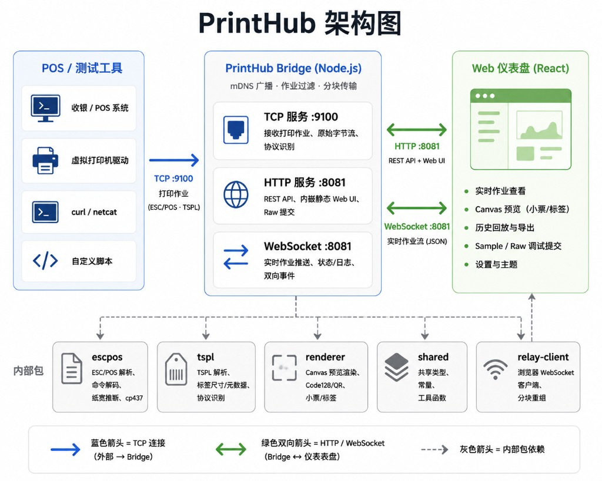

# PrintHub

> **English:** [README.md](./README.md)

[](LICENSE)
[](https://github.com/JackieLeee/PrintHub/releases)
[](https://nodejs.org/)
[](https://pnpm.io/)
[](https://www.typescriptlang.org/)
[](https://react.dev/)

## 背景

收银机、POS 和标签机通常通过 TCP 发送 **原始 ESC/POS 或 TSPL 字节流**，而不是 PDF。没有实体打印机时，很难确认发出的数据是否正确。

**PrintHub** 是一个 **局域网虚拟打印机**：接收与真实设备相同的数据，在浏览器中实时预览、查看历史，并支持 Sample 与 Raw 调试打印。

## 功能

| 能力 | 说明 |
|------|------|
| **接收** | TCP **9100** 接收 ESC/POS 小票与 TSPL 标签 |
| **预览** | Canvas 小票/标签预览 — ESC/POS（文本、位图、Code128、QR、反白、钱箱标记）与 TSPL 标签 |
| **历史** | 浏览器本地保存最近 **50** 条任务，支持回放与导出（File / Hex / Base64）；侧栏显示总数 |
| **调试** | 一键 ESC/POS & TSPL Sample；File / Hex / Base64 原始提交 — **可离线**（无需 Bridge 本地预览） |
| **命令手册** | 调试面板内可折叠的 ESC/POS & TSPL 命令参考（带展开箭头） |
| **主题与语言** | 10 套 UI 主题，名称支持 **中文 / English**；右上角工具栏可切换语言 |
| **打印机模拟** | 场景模拟（正常、缺纸、开盖、离线、慢响应、拒打）、DLE EOT 状态字节、钱箱脉冲检测、实时事件日志（最近 **50** 条） |
| **桌面应用** | Electron 集成 Bridge、菜单栏托盘、可选局域网 HTTP/WebSocket |
| **mDNS** | 广播 `_pdl-datastream._tcp` · 端口 **9100**，便于 POS / macOS 自动发现打印机 |

| 端口 | 用途 |
|------|------|
| **9100** | TCP — POS 或测试工具发送打印数据（始终开启） |
| **8081** | HTTP + WebSocket + Web 控制台（桌面端默认关闭；CLI 模式始终开启） |

### 桌面应用（macOS）

Bridge 内置于 Electron 主进程。TCP **9100** 始终可用；局域网 HTTP **默认关闭**，可在菜单栏托盘中开启。

**v1.0.0** 目前仅提供 **macOS arm64**（`.dmg`），Windows 版本后续发布。安装包见 [Releases](https://github.com/JackieLeee/PrintHub/releases)。

```bash
pnpm install
pnpm dev:desktop    # 构建并启动 PrintHub.app（macOS）
pnpm dist:desktop   # 打包 macOS .dmg（arm64）
```

托盘菜单：Bridge / TCP / 局域网状态、复制局域网地址、HTTP 端口、重启 Bridge、退出。

### Web 演示（GitHub Pages）

每次推送到 `main` 会自动部署 GitHub Pages，可用于浏览界面、切换主题，以及 **离线** 调试预览（File / Hex / Base64）。TCP 打印、打印机模拟与局域网功能仍需本地 Bridge 或桌面应用。

**在线演示：** https://jackieleee.github.io/PrintHub/

### 打印机模拟

在 **调试打印** 右侧面板可模拟打印机行为，便于联调：

| 场景 | 行为 |
|------|------|
| **正常** | 标准 DLE EOT 状态响应 |
| **缺纸** | 状态轮询返回缺纸位 |
| **开盖** | 状态轮询返回开盖位 |
| **离线** | 状态字节为 0 |
| **慢响应** | 可配置状态响应延迟 |
| **拒打** | 丢弃 TCP 传入的打印任务 |

- **红绿灯指示** — 场景与钱箱状态用绿 / 黄 / 红标识
- **钱箱** — 紧凑抽屉动画；支持手动开/关；打印数据中的 `ESC p` 开钱箱会被检测并记入事件
- **模拟事件** — WebSocket `sim.event` 推送；按时间倒序显示，自动去重

**模拟 HTTP API**（需 Bridge 运行）：

```bash
# 读取 / 更新模拟配置
curl http://localhost:8081/sim/config
curl -X POST http://localhost:8081/sim/config \
  -H "Content-Type: application/json" \
  -d '{"scenario":"paper-out"}'

# 手动开钱箱（UI 同样调用此接口）
curl -X POST http://localhost:8081/sim/drawer/kick \
  -H "Content-Type: application/json" \
  -d '{"pin":0}'
```

## 使用方法

**环境：** Node.js 20+、pnpm 9+

```bash
pnpm install
pnpm dev      # 构建 Web UI 并启动 Bridge
pnpm build:web   # 生产环境 Web UI（shared + tspl + web；CI / GitHub Pages 使用）
# 或：pnpm start  （构建后运行，无 watch）
```

1. 打开 **http://localhost:8081**（或本机局域网 IP，如 `http://192.168.1.42:8081`）。
2. **同网段其他设备**请直接访问 `http://<Bridge机器IP>:8081`，不要使用 GitHub Pages 演示站。
3. 将 POS / 应用指向 **`<Bridge机器IP>:9100`**。
4. 展开 **调试打印** — 可试用 Sample、Raw 提交、命令手册或打印机模拟。
5. 调试预览 **无需 Bridge**；TCP 场景与模拟配置需 Bridge 在 `:8081` 运行。

> **局域网连不上？** 确认 Bridge 已运行（`pnpm start`）、macOS 防火墙允许 Node 入站，且 POS/Web 使用的是 **Bridge 机器的局域网 IP**，不是 `localhost`。

**TCP 快速测试：**

```bash
printf '\x1b@\x1ba\x01Hello PrintHub\n\x1dV\x00' | nc -N localhost 9100
```

**HTTP Raw 提交：**

```bash
curl -X POST http://localhost:8081/print/raw \
  -H "Content-Type: application/octet-stream" \
  --data-binary @sample.bin
```

## 架构



**Monorepo 结构**

- `apps/desktop` — Electron 桌面应用（集成 Bridge、托盘、可选局域网 HTTP）
- `apps/web` — React 控制台
- `packages/bridge` — TCP 监听、HTTP API、WebSocket、mDNS、打印机模拟、静态 UI
- `packages/escpos`、`packages/tspl`、`packages/renderer` — 解析与渲染（ESC/POS 命令解析、TSPL 标签元数据、Code128/QR Canvas 绘制）
- `packages/shared`、`packages/relay-client` — 类型与 WS 客户端

**CLI 模式：** `pnpm dev` / `pnpm start` 构建并托管 `apps/web/dist`，Bridge 统一在 **8081** 端口。

**桌面模式：** Bridge 在 Electron 主进程运行；UI 通过 IPC 通信。可选局域网 HTTP 向其他设备提供相同 Web UI。

## Star 趋势

<a href="https://www.star-history.com/?repos=JackieLeee%2FPrintHub&type=date&legend=bottom-right">
 <picture>
   <source media="(prefers-color-scheme: dark)" srcset="https://api.star-history.com/chart?repos=JackieLeee/PrintHub&type=date&theme=dark&legend=bottom-right&sealed_token=nZ7TJ03ductF3SiTo2_x9Ry8wmdRlWLIKmXdxoqRfHGkvFTL1NlWxsoL_mwD-dvCVfMZyzyZBzIM8Ihzq8OU20MkofoZvSxuyMsDOOtdZ4QVigSvLemN2CREu9Vshu8wZoD0fdcGEmLEiHpFYXfkdgGvjq8Zi8n1CIzMHumwS2FRSd_6JyewdE8DLc-K" />
   <source media="(prefers-color-scheme: light)" srcset="https://api.star-history.com/chart?repos=JackieLeee/PrintHub&type=date&legend=bottom-right&sealed_token=nZ7TJ03ductF3SiTo2_x9Ry8wmdRlWLIKmXdxoqRfHGkvFTL1NlWxsoL_mwD-dvCVfMZyzyZBzIM8Ihzq8OU20MkofoZvSxuyMsDOOtdZ4QVigSvLemN2CREu9Vshu8wZoD0fdcGEmLEiHpFYXfkdgGvjq8Zi8n1CIzMHumwS2FRSd_6JyewdE8DLc-K" />
   
 </picture>
</a>

---

MIT License — 见 [LICENSE](./LICENSE)。  
参与贡献：[CONTRIBUTING.md](./CONTRIBUTING.md) · 安全：[SECURITY.md](./SECURITY.md)
